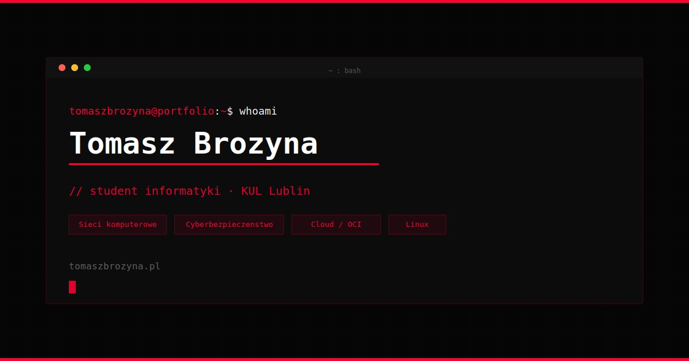

# tomaszbrozyna@portfolio:~$

> Personal portfolio website — terminal / Matrix aesthetic.  
> **Live:** [tomaszbrozyna.pl](https://tomaszbrozyna.pl)



---

## Stack

| Layer | Technology |
|---|---|
| Markup | HTML5 (semantic) |
| Styles | Custom CSS + Tailwind CSS (CDN) |
| Scripts | Vanilla JavaScript (ES2020+) |
| Fonts | JetBrains Mono, Bebas Neue (self-hosted) |
| Contact form | Formspree |
| Hosting | Oracle Cloud Infrastructure (OCI) |

## Features

- Matrix rain canvas animation (respects `prefers-reduced-motion`)
- Typewriter effect in hero section
- Timeline-based experience/education section
- Skill cards grouped by category
- Project roadmap with status badges (COMPLETED / IN PROGRESS / PLANNED)
- Contact form via Formspree
- Fully responsive — mobile hamburger menu
- SEO meta tags + Open Graph + Twitter Card
- Self-hosted fonts — no Google Fonts requests
- Custom scrollbar, scanlines overlay, CSS glow effects

## Structure

```
portfolio-website/
├── assets/
│   ├── fonts/          # JetBrains Mono, Bebas Neue (.woff2)
│   └── img/
│       ├── icons/      # SVG skill/social icons
│       ├── favicon.svg
│       ├── favicon.png
│       ├── apple-touch-icon.png
│       └── og-image.jpg
├── config/
│   └── tailwind.config.js
├── css/
│   └── styles.css
├── js/
│   └── scripts.js
├── index.html
└── README.md
```

## Running locally

No build step required — just open `index.html` in a browser or serve with any static server:

```bash
# Python
python3 -m http.server 8080

# Node (npx)
npx serve .
```

## Roadmap / upcoming projects

- **IPv4/IPv6 Subnet Calculator** — Java CLI tool
- **Password Manager + Generator** — Python / Flask / REST API
- **Homelab / OCI** — Docker services, Debian, network experiments

## Author

**Tomasz Brożyna** — CS student (networking specialization), KUL Lublin  
[github.com/tomaszbrozyna](https://github.com/tomaszbrozyna) · [linkedin.com/in/tomaszbrozyna](https://linkedin.com/in/tomaszbrozyna)

## License

[MIT](LICENSE)